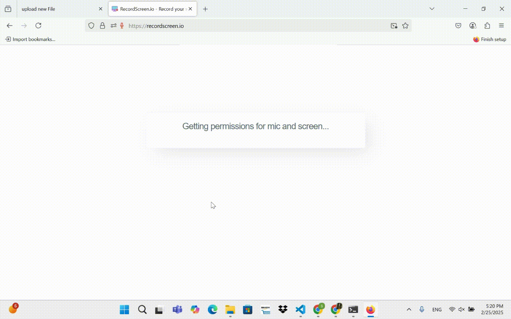

# flask-on-docker

This is a demo flask app that utilizes Instagram's tech stack, and is deployed using Docker. The production environments use Nginix and Gunicorn, with Nginx serving as the reverse proxy serverfor user-uploaded media files and Gunicorn which serves as WSGI HTTP server for the Flask application in production. PostgreSQL is used as a database to store data.




## Prerequisites

Make sure you have docker / docker compose installed. Afterwards, you can clone this repository.

## Setup Instructions

After you have cloned this repository, you need the following files:

1. .end.dev

```
FLASK_APP=project/__init__.py
FLASK_DEBUG=1
DATABASE_URL=postgresql://{your username}:{your password}@db:5432/{your db name}
SQL_HOST=db
SQL_PORT=5432
DATABASE=postgres
APP_FOLDER=/usr/src/app
```

2. .end.prod

```
FLASK_APP=project/__init__.py
FLASK_DEBUG=0
DATABASE_URL=postgresql://{your username}:{your password}@db:5432/{your db name}
SQL_HOST=db
SQL_PORT=5432
DATABASE=postgres
APP_FOLDER=/home/app/web
```

3. .env.prod.db

```
POSTGRES_USER={your username}
POSTGRES_PASSWORD={your password}
POSTGRES_DB={your db name}
```

Afterwards, edit the `docker-compose.yml` file so that it uses your username and password for the db. Now, we can use docker compose to start building!

## Building

Before we build, we must ensure that port forwarding is enabled.This allows us to run our flask application locally. The default for production is `1486`. Once port forwarding is enabled, run the following commands in order:

```
$ docker compose down -v
```

This command allows us to bring down any open, pre-existing containers and volumes.

Next run the following commands:

```
$ docker compose -f docker-compose.prod.yml up -d --build
$ docker compose -f docker-compose.prod.yml exec web python manage.py create_db
```

The first command builds a new image and spins the containers. The next command creates the table where images will be stored. Once you are finished, you can run the first command in this section to spin down your containers.

## Results

To see your local flask application, you want to go to the following link in firefox:

`localhost:PORT/upload`.

PORT depends on your first number in your portforwarding. From here, you can browse and upload your image.

To see your image, go to the following link: 

`localhost:PORT/upload/FILENAME`.

 If there are any issues, please let me know!
